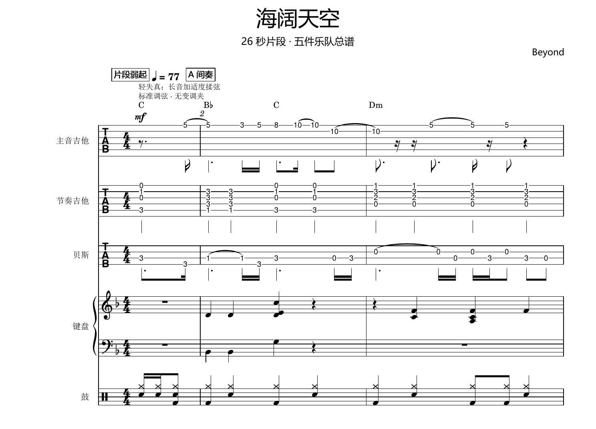
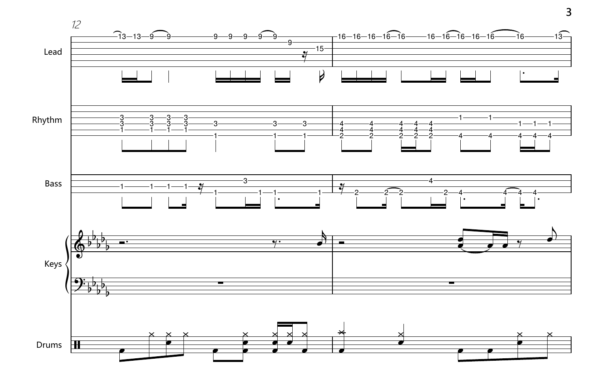
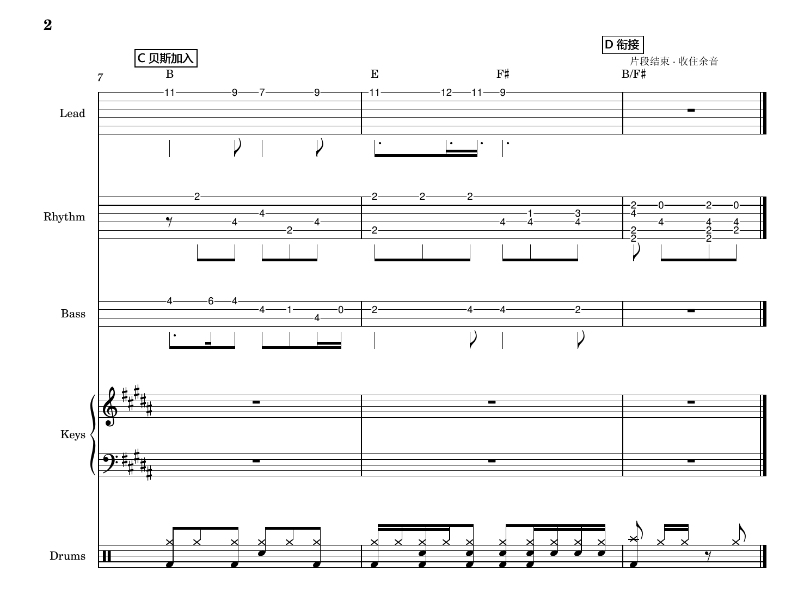

# Audio to Band Score

An agent skill for turning a mixed song recording into a playable five-piece school band arrangement.

It combines time-aligned source separation, musical analysis, practical arranging, notation checks, and MuseScore export to deliver rehearsal-ready **MIDI**, **PDF**, and editable **MSCZ** files.


> [!NOTE]
> This is an agent skill, not a standalone desktop application. It is designed to guide an agent through the full arrangement workflow while keeping musical decisions, evidence, and limitations explicit.

## Score previews

These excerpts show representative bars from three generated five-piece arrangements. Each image is a lightweight PNG so it renders directly in GitHub's README view.

### Beyond — 海阔天空



### Koe — 声



### Haruhikage — 春日影



## Contents

- [Score previews](#score-previews)
- [What it does](#what-it-does)
- [Default instrumentation](#default-instrumentation)
- [Workflow](#workflow)
- [Quick start](#quick-start)
- [Outputs](#outputs)
- [Repository layout](#repository-layout)
- [Quality model and limitations](#quality-model-and-limitations)
- [Testing](#testing)
- [Contributing](#contributing)
- [Credits](#credits)
- [License](#license)

## What it does

Audio to Band Score is built for users who have a finished song recording but need a practical band chart rather than raw stems or an unedited MIDI transcription.

### Core capabilities

- Separates a mixed recording into time-aligned analysis stems with Demucs.
- Compares four-source and six-source separation results when the higher-quality profile is used.
- Identifies song sections, tempo candidates, time signatures, harmony, bass movement, riffs, fills, and musical entry points.
- Reassigns parts between two guitars, bass, keyboard, and drums with playability in mind.
- Supports beginner, school-amateur intermediate, and advanced difficulty targets.
- Produces a structured, editable MuseScore score instead of treating raw recognition output as a finished chart.
- Audits score structure, TAB string/fret relationships, export safety, and file consistency.
- Uses local and free tools by default; audio is not uploaded to a paid external API by this workflow.

## Default instrumentation

The default arrangement is a five-instrument accompaniment for a singer:

| Part | Notation | Typical role |
| --- | --- | --- |
| Lead guitar | Rhythmic six-string TAB | Signature riffs, hooks, fills, and instrumental themes |
| Rhythm guitar | Rhythmic six-string TAB | Chords, strumming, arpeggios, and groove support |
| Bass | Rhythmic four-string TAB | Root motion, transitions, and low-end movement |
| Keyboard | Grand staff | Harmony, pads, counter-lines, and keyboard-specific motifs |
| Drums | Standard five-line drum notation | Groove, accents, transitions, and fills |

The vocal track is used to understand song structure, breathing space, and entry points. Vocals are not added to the instrumental score by default.

## Workflow

```text
Mixed recording
    → time-aligned source separation
    → beat, section, harmony, and note-candidate analysis
    → instrument assignment and playability edits
    → MuseScore notation
    → structural audit and visual/file checks
    → MIDI + PDF + editable MSCZ
```

The guiding principle is **playable fidelity**: preserve the song's harmonic movement, groove, structure, recognizable riffs, and important transitions, while simplifying or redistributing details that would not be practical for the requested players.

## Quick start

### 1. Clone the repository

```bash
git clone https://github.com/kiri603/To-Sheet-Music-Skill.git
cd To-Sheet-Music-Skill
```

### 2. Prepare the local environment

The workflow does not install software or download model weights automatically. Prepare a dedicated environment and install only the components needed for the task:

```bash
python3.11 -m venv work/audio-env
source work/audio-env/bin/activate
python -m pip install demucs numpy soundfile imageio-ffmpeg
```

On Windows, use the Python executable under `work/audio-env/Scripts/` after creating the virtual environment. Python 3.11 is the recommended compatibility baseline; verify package compatibility with the interpreter already available on your machine before installing.

You also need:

- **FFmpeg** for audio decoding. It may be provided by the system, `--ffmpeg`, or `imageio-ffmpeg`.
- **MuseScore Studio** for opening the score and exporting MIDI/PDF.
- Optional transcription and QA tools such as `librosa`, `basic-pitch`, `pretty_midi`, `mido`, `music21`, `pypdf`, and Poppler, depending on the task.
- CUDA is optional. CPU processing is supported when no compatible GPU is available.

### 3. Make the skill available to your agent

This repository is packaged around [`SKILL.md`](SKILL.md) and [`agents/openai.yaml`](agents/openai.yaml). Make the repository available to your agent runtime, then invoke it with a request such as:

```text
Use $audio-to-band-score to arrange "song.wav" for lead guitar, rhythm guitar,
bass, keyboard, and drums at the default school-amateur intermediate level.
Preserve the original song structure and recognizable riffs, then deliver MIDI,
PDF, and editable MSCZ files.
```

The user's requested tuning, key, difficulty, song length, instrumentation, and arrangement constraints take precedence over the defaults.

### 4. Run source separation directly

The separation helper can be used independently for analysis:

```bash
python scripts/separate_audio.py \
  --input "path/to/song.wav" \
  --out-dir "work/separation-v1" \
  --profile high \
  --device auto
```

`high` runs both the four-source and six-source Demucs analyses. `balanced` runs the six-source analysis only and is intended for internal trials or resource-constrained environments. Output directories must be new; existing directories are never overwritten.

### 5. Audit and export a completed score

After the agent has prepared `work/final.mscz`, audit it and export from the same native MuseScore file:

```bash
python scripts/score_tools.py audit \
  --score "work/final.mscz" \
  --report "work/audit.json"

python scripts/score_tools.py export \
  --score "work/final.mscz" \
  --out-dir "work/export-v1" \
  --name "song_band" \
  --musescore "/path/to/MuseScore"
```

The export helper refuses to overwrite an existing output directory and publishes the directory only when all three requested formats are generated successfully.

## Outputs

The standard delivery contains:

| File | Purpose |
| --- | --- |
| `<song>_band.mid` | Playback and DAW/MIDI inspection |
| `<song>_band.pdf` | Printable rehearsal score |
| `<song>_band.mscz` | Editable native MuseScore score |

Working files may also include `manifest.json`, separated WAV stems, analysis notes, MIDI candidates, MusicXML, and rendered PDF pages. These are kept as evidence and QA artifacts unless the user asks for them.

## Repository layout

```text
.
├── SKILL.md                         # Main agent instructions
├── agents/
│   └── openai.yaml                  # Display metadata and default prompt
├── assets/
│   ├── band-style.mss               # MuseScore page/style settings
│   ├── band-template.mscx           # Empty five-part score template
│   └── score-previews/               # Representative score excerpts
│       ├── beyond.png
│       ├── koe.png
│       └── haruhikage.png
├── references/
│   ├── arranging.md                 # Transcription and playability rules
│   ├── notation-and-qa.md           # Score standards and acceptance checks
│   ├── separation.md                # Stem separation design and data flow
│   └── toolchain.md                 # Free tools and runtime guidance
└── scripts/
    ├── separate_audio.py            # Time-aligned Demucs analysis
    ├── score_tools.py               # MuseScore audit and export helpers
    └── test_*.py                    # Workflow and structural tests
```

## Quality model and limitations

This skill treats model output as **evidence**, not as unquestionable truth.

- Separation stems are kept on a common timeline and checked for sample-rate, channel, and frame-count consistency.
- Six-source `guitar` and `piano` outputs are candidates; they are not assumed to be perfect isolated tracks or two independent guitar parts.
- Guitar, bass, keyboard, and drum parts are cross-checked against the mix, repeated sections, harmony, rhythm, and instrument-specific constraints.
- `score_tools.py audit` performs structural and selected TAB checks. It does not prove that every beat, note, articulation, or simultaneous performance is musically correct.
- The workflow does not claim zero-error transcription, human listening review, SDR/SIR accuracy, or full audio fidelity unless the relevant evidence actually exists.
- Model weights are not bundled with the repository. They are downloaded on demand by the local environment when required.
- The skill is not intended for speech-to-text, lyric translation, or downloading an existing score.

Only process recordings and reference material that you have the right to use.

## Testing

Run the bundled tests from the repository root:

```bash
python -m unittest discover -s scripts -p "test_*.py" -v
```

The test suite covers separation edge cases, bounded model-download retries, timeline validation, TAB pitch/string checks, structural score checks, and export safeguards. Passing these tests verifies the helper workflow; it is not a measure of musical transcription accuracy.

## Contributing

Issues and pull requests are welcome. When reporting a problem, include:

- operating system and Python version;
- installed versions of Demucs, PyTorch, FFmpeg, and MuseScore;
- the command or agent request that was used;
- the relevant `manifest.json`, audit report, or error log;
- a short description of the expected and observed behavior.

Please do not commit private recordings, model caches, credentials, generated `__pycache__` files, or other large temporary artifacts.

## Credits

This project builds on the following tools and standards:

- [Demucs](https://github.com/adefossez/demucs) for music source separation.
- [Basic Pitch](https://github.com/spotify/basic-pitch) for optional single-instrument note candidates.
- [librosa](https://librosa.org/) for optional audio and beat analysis.
- [MuseScore Studio](https://musescore.org/) for notation, score editing, and export.
- [MusicXML](https://www.w3.org/2021/06/musicxml40/) for interoperable notation data.

Please review and comply with the license terms of every tool, model, dataset, and recording used in a particular workflow.

## License

This repository does not currently include a project-level `LICENSE` file. Until one is added, do not assume that the repository's code or assets are licensed for redistribution. Third-party tools and model weights retain their own licenses.
